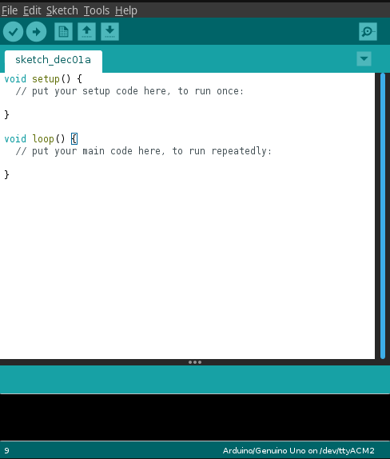
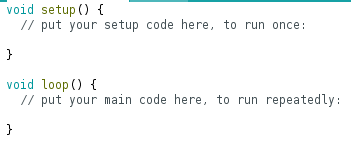

# Lesson 1: Setting up the Arduino IDE and tour of the Arduino [~10 minutes]

In order to install arduino code onto an arduino, you need the Arduino IDE.
Installer packages can be found on the [arduino site](https://www.arduino.cc/en/Main/Software#download). 

Next, plug in the arudino to the computer that the Arduino IDE was installed on. Lights should come up on the aruduino, indicating that it has power.

Next, start the IDE, it should look like this: 



## Tour of the Arduino IDE

| Section of the IDE | Name                | Description                                                           |
| ------------------ | ------------------- | --------------------------------------------------------------------- |
|     | Verify              | Verifies your code, notifying of any syntax errors                    |
|     | Upload              | Upload code to the arduino, and run the code                          |
|        | New Sketch          | Opens a new empty sketch in a new window                              |
|   | Open/Save           | Open or save a sketch, respectively                                   |
|  | Open Serial Monitor | Open the serial monitor                                               |
|       | File tabs           | If you have multiple files open in one window, they will show as tabs |
|   | Code Area           | The code area, where code will be printed                             |

## Selecting your device

Next, you need to tell the IDE to look for your device. In order to do that,
Click the `Tools` dropdown menu, and go to `Port`. Select your arduino board.

TODO image here

## Tour of Arduino Coding - Hello World

As the comments indicate, it will run the code in the `setup` function
once when the program is started, and then runs the code in `loop` over and
over, forever.

The lines that start with `//` are called *comments*, and are ignored. It is considered good practice to
put comments around relative complex pieces of code so someone can read your code better.

If you press the upload button (the right arrow), it will upload the code
to the arduino (provided that the correct device is selected under `Tools->Port`). Nothing will happen, as there
is no code in the `setup` or `loop` functions. 

In order to get the arduino to do someting, we need to add code. In the `setup` function, add the following lines of code:

```C++
Serial.begin(9600); // Set the baud rate for the serial connection
Serial.println("Hello World!"); // Send the message 'Hello World!' over serial.
```

The computer and the arduino are connected over a serial connection so they can share data. If you are curious
about how this all works under the hood, you can [read this wikipedia article](https://en.wikipedia.org/wiki/Asynchronous_serial_communication).

Regardless, upload the code to the arduino using the upload button () then open the serial monitor (). In the serial monitor, set the baud rate to 9600:

TODO INSERT IMAGE

In the serial monitor, you should see `Hello World`:

TODO INSERT IMAGE

## Tour of the Arduino


On the top of the arduino, there are digital input and output pins, labeled from 0 to 13, 
making for 14 digital pins total. Digital means that the pins will represent either a 1
or a 0, so either some positive voltage (for a 1) or a zero voltage (for a zero).

On the lower right, there is the analog pins, labeled A0 througth A5, for 6 pins. 
Analog pins input a voltage that varies between 0 and 1.

In this project you will use both digital and analog pins.

On the lower middle of the arduino, there is the power section, which provides ground pins and pins 
that are +5V and +3.3V with respect to ground. These will be used later when wiring up various sensors.
