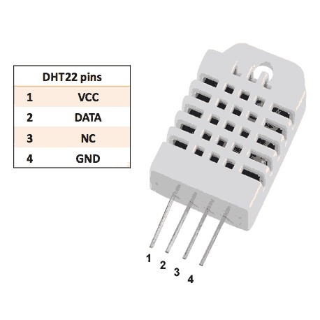
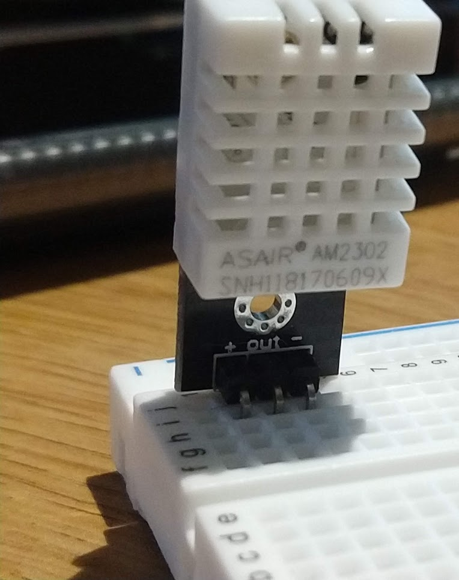
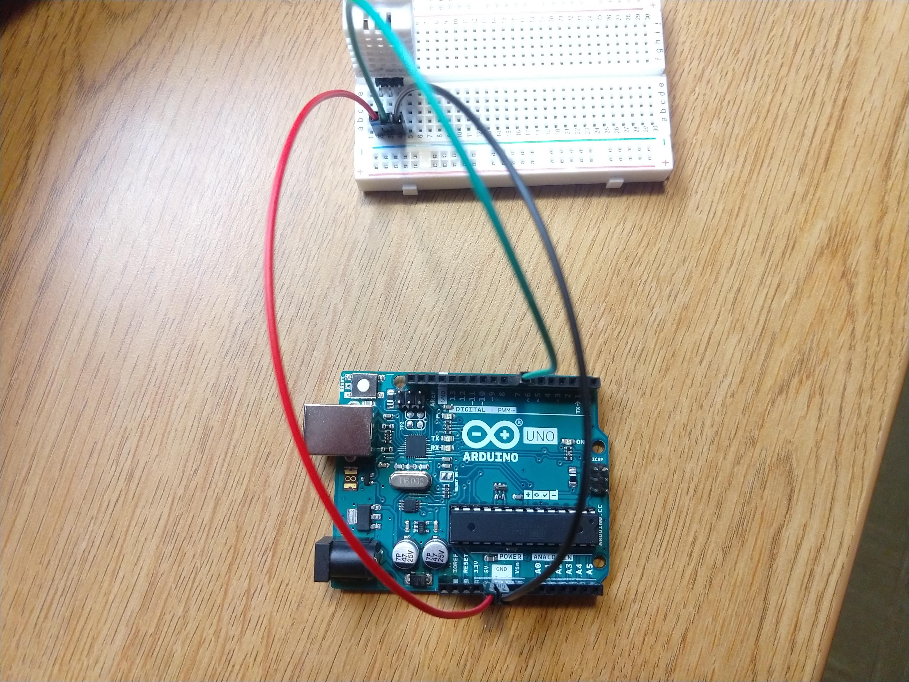
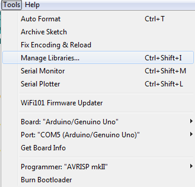
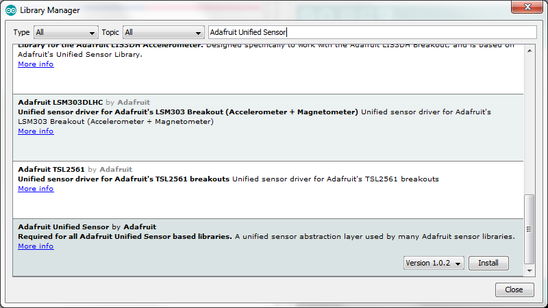
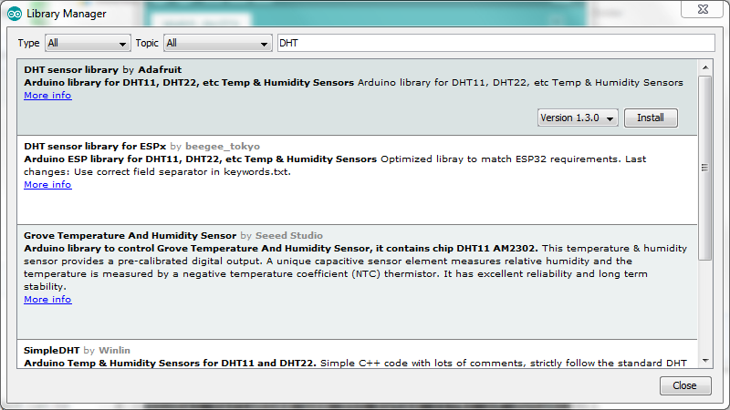

# Lesson 2: Setting up the Temperature/Humidity Sensor [~20 minutes]

Now that we have the arduino IDE setup, we can set up sensors. 

## Tour of breadboards

Breadboards are a tool to allow quick prototyping of electrical components.
They feature powerlines running down the sides, and between them there are
two columns of connected rows.

This gif shows how each pin in the breadboard is connected to each other:


> Image Source: https://learn.adafruit.com/assets/35419

## Tour of the DHT-22 Unit


The DHT-22 sensor doubles as both a theromometer and a humidity sensor.
It is a simple unit with 3 or 4 pins:


> Image Source: https://leeselectronic.com/en/product/7375.html

If your DHT-22 pin only has 3 pins, then it doen't have what is labled as
pin 3 in the above photo, which does nothing anyways. 

## Wiring it up

Insert it into your breadboard horizonitally, so that each pin is *not* 
connected to each other:



Wire the GND pin, which is at the far right side and also marked 
with a `-`, to a GND pin on the arduino, the `+` pin to +5V on the arduino,
and wire the data pin (the middle pin) to one of the digital input pins
on the arduino:



## Coding it

The code for this has two basic requirements:

1. Fetch the data from the sensor
2. Display it (via Serial)

### Installing the DHT library

In order to interface with the sensor, we need to use a library
(someone else's code). 

In the arduino IDE, go to `Tools`->`Manage Libraries...`:



Search for 'Adafruit Unified Sensor' in the search bar and install the library:



And also install 'DHT sensor library' by adafruit:



Now, to make sure that it installed correctly, insert `#include <DHT.h>`
at the top of your arduino code and click the check button, ensuring no errors.

### Writing the code

After the `#include` statement, create a DHT sensor:

```C++
DHT dhtSensor(7, DHT22);
```

This creates a new object of type `DHT`, with the name `dhtSensor`, initialized with
the parameters `(7, DHT22)`. 7 indicates the pin which the sensor is plugged into.
DHT22 indicates the chip type. This library is capable of working with both DHT11
and DHT22 sensors, so we must indicate that it's a DHT22 chip.

Next, in the `setup` function (between the `{` and `}`), add the following line of code:

```C++
dhtSensor.begin();
```

This initializes the library. 

Now, in the loop function, insert the following between the `{` and `}`:

```C++
float temp = dhtSensor.readTemperature();
Serial.println(temp);
delay(1000);
```

for a full source code of:

```C++
#include <DHT.h>

DHT dhtSensor(7, DHT22);

void setup() {
    Serial.begin(9600);
    dhtSensor.begin();
}

void loop() {
    float temp = dhtSensor.readTemperature();
    Serial.println(temp);
    delay(1000);
}
```

`dhtSensor.readTemperature()` is a function that gets the
temperature reading from the sensor, and it is then stored to
the name `temp`, which is of the type `float`, which means 
it is a real number (can be between integers).

`Serial.println(temp)` outputs that temperature to the serial monitor,
and `delay(1000)` waits a second, to put spacing between temperature readings.

Runing this code and opening the serial monitor should print the current temperature,
in celcius, very second.
