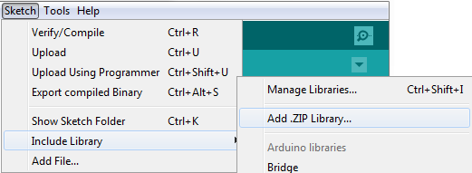
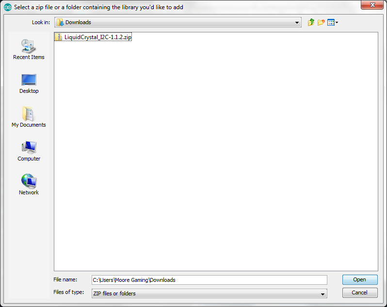
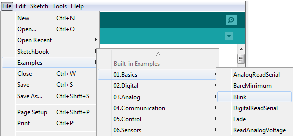
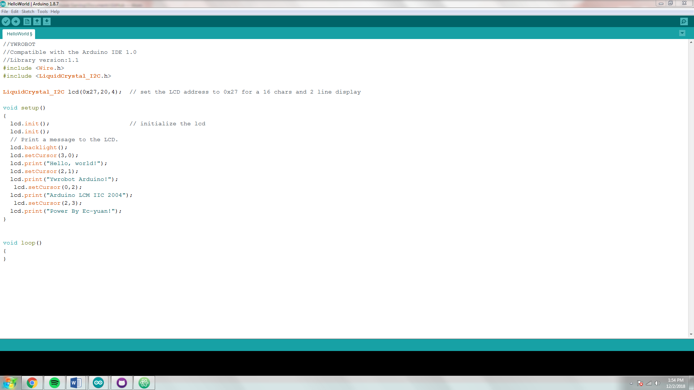

# Lesson 4: Weather station functions [~60 minutes]

In our code, we can do a lot more than printing an output. Generally, when we want our code to do something, we find a library that can do what we want, we add the header file using a `#`, and we use the functions we want inside the code to achieve the final result.

This tutorial will walk you through this process allowing you to use any functions you can think of. This means you will, in theory, be able to do whatever you want with the code.

Let's get started!

### Step one:

First, we need to find a library to use that includes the functions we want. You already did this process in lesson 2, but we will review it here. Going to `Tools`->`Manage Libraries...` will allow you to find libraries. From there, you can then search any library you want and install it. You already have the `DHT Sensor Library` that we will need to operate our temperature and humidity sensor for the weather station, but we need to be able to output the results somehow. For this, we will use an LCD panel. The LCD panel needs to be told what to display and how to do it, so we need a library!

But now we have an issue... The library we need cannot be found under `Tools`->`Manage Libraries...`. So how do we install it?

First, go to the website that has the download for the library at https://www.arduinolibraries.info/libraries/liquid-crystal-i2-c. The website will look like this:


Click on the button that says `LiquidCrystal_I2C-1.1.2.zip`. This will download the library to your computer. We then need to add this to the arduino software. To do this, we will go to `Sketch`->`Include Library`->`Add .ZIP Library...`



Then, go to your downloads folder. Double clicking on a folder will allow you to open it. When you finally can see `LiquidCrystal_I2C-1.1.2.zip`, click on it once. Then click open.



Congratulations! You have just added a library from the internet. This process can be repeated to gather any library you need. The possibilities are endless!

### Step two:

Now that we have a library, we need to learn how to use it. This is the portion where you will have to take some time to learn on your own. This part is the main skill of coding. Being able to look at example code and turning it into what you want to do is the most important thing. To begin, click `Files`->`Examples`->`01.Basics`->`Blink`



Try to figure out what this code does. Upload it to the arduino, look at what the arduino does, and decide what each line of code is doing under the hood.

---

This code is making the built in LED on the arduino blink. If you figured this out, congratulations. This is a major staple for arduino programming. Try opening more and more example files and figure out what they do. ***Keep in mind, some of the examples require more things to be plugged into the arduino and will not work. In this case, just look at the code and imagine what it will do.***

---

Now, use `Files`->`Examples`->`LiquidCrystal I2C`->`HelloWorld` to open the code shown below.



Notice that the code has
```C++
#include <Wire.h>
#include <LiquidCrystal_I2C.h>
```
These lines will add the code contained in these files to our code, and will allow us to use the functions they have.

Also, notice the
```C++
LiquidCrystal_I2C lcd(0x27,20,4);
```

This line tells the arduino that there is an LCD connected. Its address is 0x27. The remaining two numbers are defaults that tell the code how large the LCD is. In arduino programming, we don't really care why this works since we just need to use it. We look at example files to figure out how the library works, we put the code necessary into our own file, and we modify to make it do what we want.

Look, for instance, at
```C++
void setup()
{
  lcd.init();                      // initialize the lcd
  lcd.init();
  // Print a message to the LCD.
  lcd.backlight();
  lcd.setCursor(3,0);
  lcd.print("Hello, world!");
  lcd.setCursor(2,1);
  lcd.print("Ywrobot Arduino!");
   lcd.setCursor(0,2);
  lcd.print("Arduino LCM IIC 2004");
   lcd.setCursor(2,3);
  lcd.print("Power By Ec-yuan!");
}
```

From what we see, `lcd.init()` initizlizes the LCD panel. `lcd.backlight()` does something unknown to us at this point, but it is another initializing feature. `lcd.setCursor(int x, int y)` sets where the LCD will begin printing. And `lcd.print("Some string here")` prints that to the LCD screen.

If we wanted to print our name to the screen, we would do something like this:

```C++
#include <Wire.h>
#include <LiquidCrystal_I2C.h>

LiquidCrystal_I2C lcd(0x27,20,4);

void setup() {
  lcd.init();
  lcd.backlight();
  lcd.setCursor(0,0);
  lcd.print("First name");
  lcd.setCursor(0,1);
  lcd.print("Last name");
}

void loop() {

}
```

We don't fully understand why anything but `lcd.print()` works, but we don't need to. By editing slight blocks of code, we can achieve the result we want to. If you were to connect an LCD panel to the code, you would see `First name` and `Last name` displaying on the LCD. By changing the cursor position, you could also see how the cursor system works. By using this method (downloading a library, looking at example code, and editing the code), you can make your code do whatever you like.

This is the main method we will use for programming in arduino. Now that you know the general method and how the LCD library works, you must learn how to use a temperature and humidity sensor, something that was already mentioned in lesson 2.

---

### ***Challenge***

Create a simple code that displays temperature and humidity data to the serial monitor. We will setup the LCD panel in the next lesson, but for now, use lesson 2 as an example. Create your own code that will take in temperature and humidity data and output it using `Serial.print()` and `Serial.prinln()`. Don't forget to include the library needed with an preprocessor statement. Finally, while you might have never seen the function that gets the humidity data, it is very similar to the one found in lesson 2 that reads temperature. Try to figure out what the command is by yourself before moving on to the example solution.

**Before you begin:** wire the DHT temperature and humidity sensor to the arduino as shown in lesson 2. If this is not completed before sending the code to the arduino, you will not get the output you expect! The pin number you use in the code must match the pin the middle pin on the sensor is plugged into or the code will not receive the data it should and the output will not operate properly.

---

***The solution to this challenge is below. Do not continue on until you have attempted the challenge!!***

---

#### Example answer

Keep in mind, your answer might not look like this. If it doesn't, don't worry. All we need is the result in the serial monitor to receive and print the temperature and humidity. Keep in mind, the sensor outputs degrees Celsius and percent humidity by default.

```C++
#include "DHT.h"

DHT dhtSensor(7, DHT22);

void setup() {
  dhtSensor.begin();
  Serial.begin(9600);
}

void loop() {
  float temperature;
  float humidity;
  temperature = dhtSensor.readTemperature();
  humidity = dhtSensor.readHumidity();
  Serial.print("Temperature: ");
  Serial.print(temperature);
  Serial.println(" *C");
  Serial.print("Humidity: ");
  Serial.print(humidity);
  Serial.println("%");
  delay(5000);
}
```

This code will read the temperature and humidity every 5 seconds. This is not the cleanest form that it could be in, but this code works like it should.

---

Congratulations, you are well on your way to being able to do whatever you want with programming. In the next lesson, we will use this knowledge to build a simple weather station!

---

If you have any issues with the arduino, visit the [issues page.](issues.md)
