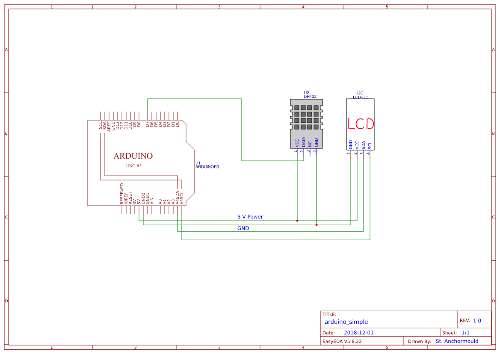

# Lesson 5: Simple weather station creation [~60 minutes]

This lesson will walk you through the setup of a simple weather station. You will then get to write your own code for the station and debug existing code to make it work.

Let's get started!

### Step one:

#### Overview

There are two parts to a simple arduino weather station. There is the circuit and the code. In order to write code for the arduino, we must first setup the circuit. The following is a circuit diagram for the setup.



Each green line shows where a cable is to go on the actual circuit. In this scenario, the use on a breadboard looks slightly different. We need to connect two sensors (`DHT22` and `LCD I2C`) to 5V power, but the arduino only has one pin for this. Therefore, the arduino 5V power should be sent to the '+' rail of the breadboard, and each 5V power pin on the sensors should be connected to that '+' rail. Eventually, you will be able to look at a schematic like this and create the circuit, but for now, this is probably overwhelming. Don't worry; we will get there!

In this tutorial, you will build the circuit shown above, then look back at the schematic to understand what exactly happens. To start, follow the instructions used in lesson 2 to hook up the DHT temperature and humidity sensor. What you see on the schematic is very close to this setup. But notice this, both the LCD we use and the DHT sensor need 5 volts of power. But the arduino can only output 5 volts of power to one pin, and we cannot connect two pins to one slot. This is where the breadboard comes into play.

### Step two:

#### Circuit connections

Plug a cable from the 5V pin on the arduino to one of slots on the breadboard in the column marked `+`. Now, all of this column is essentially plugged into the 5 volt pin on the arduino. So, you now should plug the VCC/5V pin on the DHT temperature and humidity sensor. If the ground and data pins are connected like in lesson 2, you're set!


> ***CAUTION: THE LEFT AND RIGHT SIDES OF THE BREADBOARD ARE NOT CONNECTED!!! IF YOU PUT SOMETHING ON ONE SIDE, IT MUST BE CONNECTED THROUGH A SLOT ON THAT SIDE!!!***

While the image is slightly out of focus (the cables mess it up every time), you can still the the basic premise. The sensor is connected to the `+` column. The `+` column is then connected to the arduino. Therefore, the sensor is connected to the arduino. Use this idea when connecting the sensor and LCD to the arduino if you would like. Remember, every pin in the `+` column is connected to each other.

Following this convention using the red and black wires makes looking at the circuit easier. The image above does not follow this convention simply to show you a contrast between the two wires. Not using this convention is not the end of the world, but it will make your life a lot easier in the future.

> ***IF YOU CAN, USE A RED WIRE FOR ANYTHING CONNECTED TO 5 VOLTS OR 3.3 VOLTS. RED IS A UNIVERSAL SYMBOL FOR POWER. USE A BLACK CABLE FOR ANYTHING CONNECTED TO GROUND. ANY OTHER COLOR CAN BE USED FOR DATA LINES.***

Now, we have to connect the LCD panel. First, connect the pin labeled GND to the remaining GND pin on the arduino. Then, connect VCC to the + rail on the breadboard that is connected to the arduino. Note: this should be the same column that the DHT sensor is connected to. Then, connect the SDA pin on the LCD to pin A4 on the arduino, and connect the SCL pin on the LCD to pin A5 on the arduino.

If you would like, you can plug the individual components into the breadboard so that the pins are parallel to the + column. Remember, each row (left to right) and column (top to bottom) are completely connected. This means that if you connect a sensor to the breadboard, you can then run a cable from a couple slots away while still connecting to the device. This is shown by the picture below.

---

If you have this down, congratulations! It's time to move on to coding!

---

#### Coding the weather station

Using your knowledge of the DHT sensor and the LCD library, try to create a code that displays the temperature or humidity. If you can find a way to display both, do it.  ***Hint: try having the temperature and humidity display alternate every couple of seconds!*** Try to spend around 30 minutes to an hour on this bit of code until it works. If you can't get it after quite some time, an example code is below. But, in order for this exercise to work fully, you should program this yourself!

> To clear the LCD, type `lcd.clear()`. This will remove everything from the LCD panel's display.

---

#### Example simple weather station code
---

```C++
#include <Wire.h>
#include <LiquidCrystal_I2C.h>
#include "DHT.h"

DHT dhtSensor(7, DHT22);
LiquidCrystal_I2C lcd(0x27, 20, 4);

void setup() {
  dhtSensor.begin();
  lcd.init();
  lcd.backlight();
  lcd.setCursor(0,0);
  //The next two lines are unnecessary and is only here so you can tell if the LCD panel is working or not very quickly.
  lcd.print("Initializing");
  delay(5000);
  lcd.clear();
}

void loop() {
  float temperature;
  float humidity;
  temperature = dhtSensor.readTemperature();
  humidity = dhtSensor.readHumidity();
  lcd.clear();
  lcd.setCursor(0,0);
  lcd.print("Temperature:");
  lcd.setCursor(0,1);
  lcd.print(temperature);
  lcd.print (" *C");
  delay(5000);
  lcd.clear();
  lcd.setCursor(0,0);
  lcd.print("Humidity:");
  lcd.setCursor(0,1);
  lcd.print(humidity);
  lcd.print ("%");
  delay(5000);
}
```

---

Take a look at the code you have written. Compare this to the example. This is just one way to do it, so yours is probably different. Either way, if you have a working result, you're a programmer now. If not, keep working on it. Eventually, it will work.

### Step four:

#### Learning in the future

While programming using code that you already have been exposed to is easy, the main challenge of programming is figuring out new functions and expressions on your own. We have a challenge for you that helps you work on this.

Look at the code below. It is written using more complex features that you are not yet familiar with. This is how you will learn. By looking at the more complicated code and seeing the output, you can slowly learn how it works. For this set of lessons, we don't need to get into the differences in this code. We simply want to teach you more about functions.

The example code you will see has individual things in their own functions. For instance, rather than having the LCD print the values in the `loop()` function, this code has a function that takes in a value in the `()` and prints it to the LCD. This is how actual code is usually written even though it does the same thing that is shown above.

This code is designed for a weather station that has a wind sensor attached. `void loop()` calls a function that reads the wind. `void loop()` then uses that value in the LCD print function to print it to the LCD. There is a bit of code in the LCD print function that handles the wind speed data. Your task is to delete all traces of the wind sensor from the code for your station that doesn't include one.

This is a task in understanding what code does without knowing how every single line works. The code is listed below. Even further below is the solution. For this task, there is one correct solution, so it should match perfectly.

> *Hint: copy the text from the code below into the arduino software. Then edit it. From there, you should compare with the answer key*

---

#### Example complex weather station

```C++
#include <Wire.h>
#include <LiquidCrystal_I2C.h>
#include "DHT.h"

#define DHT_PIN 7
#define WIND_SENSOR_PIN A0
#define DHT_TYPE DHT22
#define BACKLIGHT_PIN 13

DHT dhtSensor(DHT_PIN, DHT_TYPE);
LiquidCrystal_I2C lcd(0x27, 20, 4);

float voltageConversionConstant = 0.004882814;

 float temperatureRead() {
  float temperature = dhtSensor.readTemperature();
  return temperature;
 }

 float humidityRead() {
  float humidity = dhtSensor.readHumidity();
  return humidity;
 }

float windRead() {
  int analogValue = analogRead(WIND_SENSOR_PIN);
  float voltage = analogValue * voltageConversionConstant;
  float windSpeed = (voltage - 0.4) * 32.4/(2 - 0.4);
  if(windSpeed < 0) {
    return 0;
  }else{
    return windSpeed;
  }
}

//This function accepts a string, 'dataType' and floating point number, 'dataValue'
//in order to print the value to the LCD.
void lcdWrite(char dataType[4], float dataValue) {
  if(dataType == "Tem"){
    lcd.clear();
    lcd.setCursor(0,0);
    lcd.print("Temperature:");
    lcd.setCursor(0,1);
    lcd.print(dataValue);
    lcd.print (" *C");
  }else if(dataType == "Hum"){
    lcd.clear();
    lcd.setCursor(0,0);
    lcd.print("Humidity:");
    lcd.setCursor(0,1);
    lcd.print(dataValue);
    lcd.print (" %");
  }else{
    lcd.clear();
    lcd.setCursor(0,0);
    lcd.print("Wind Speed:");
    lcd.setCursor(0,1);
    lcd.print(dataValue);
    lcd.print (" km/hr");
  }
}

void setup() {
  //Initialize the DHT sensor
  dhtSensor.begin();
  //Initialize the LCD
  lcd.init();
  lcd.backlight();
  //Set where the LCD is to print. (0,0) is the top left corner.
  lcd.setCursor(0,0);
  //Print 'Initializing' to the LCD
  lcd.print("Initializing");
  delay(5000);
  //Clear the LCD
  lcd.clear();
}

void loop() {
  //Create a string called 'dataType'
  char dataType[4];
  //Create 3 integers
  float temperature = temperatureRead();
  float humidity = humidityRead();
  float wind = windRead();
  //Send two values, 'dataType' and the value to lcdWrite()
  //It will then print that to the LCD
  lcdWrite("Tem", temperature);
  delay(5000);
  lcdWrite("Hum", humidity);
  delay(5000);
  lcdWrite("Win", wind);
  delay(5000);
}
```
---

#### Answer code

```C++
#include <Wire.h>
#include <LiquidCrystal_I2C.h>
#include "DHT.h"

#define DHT_PIN 7
#define DHT_TYPE DHT22
#define BACKLIGHT_PIN 13

DHT dhtSensor(DHT_PIN, DHT_TYPE);
LiquidCrystal_I2C lcd(0x27, 20, 4);

 float temperatureRead() {
  float temperature = dhtSensor.readTemperature();
  return temperature;
 }

 float humidityRead() {
  float humidity = dhtSensor.readHumidity();
  return humidity;
 }

//This function accepts a string, 'dataType' and floating point number, 'dataValue'
//in order to print the value to the LCD.
void lcdWrite(char dataType[4], float dataValue) {
  if(dataType == "Tem"){
    lcd.clear();
    lcd.setCursor(0,0);
    lcd.print("Temperature:");
    lcd.setCursor(0,1);
    lcd.print(dataValue);
    lcd.print (" *C");
  }else{
    lcd.clear();
    lcd.setCursor(0,0);
    lcd.print("Humidity:");
    lcd.setCursor(0,1);
    lcd.print(dataValue);
    lcd.print (" %");
  }
}

void setup() {
  //Initialize the DHT sensor
  dhtSensor.begin();
  //Initialize the LCD
  lcd.init();
  lcd.backlight();
  //Set where the LCD is to print. (0,0) is the top left corner.
  lcd.setCursor(0,0);
  //Print 'Initializing' to the LCD
  lcd.print("Initializing");
  delay(5000);
  //Clear the LCD
  lcd.clear();
}

void loop() {
  //Create a string called 'dataType'
  char dataType[4];
  //Create 3 integers
  float temperature = temperatureRead();
  float humidity = humidityRead();
  //Send two values, 'dataType' and the value to lcdWrite()
  //It will then print that to the LCD
  lcdWrite("Tem", temperature);
  delay(5000);
  lcdWrite("Hum", humidity);
  delay(5000);
}
````

---

If you got that, congratulations! You're well on your way to being able to learn everything there is to know about arduino programming. There is a lot left to learn, but you have demonstrated the necessary skills to get the job done!

Now, as a reward, we are going to setup a super complicated weather station. We aren't going to fully explain this as it would take years and years to master programming well enough to create the station from scratch. So, we are just going to give you the instructions to set it up. Hopefully, you will find this project cool enough to continue learning to the point that you can create this on your own one day!

But, before you move on, please complete assignments 2 and 3. They can be found here: [assignment 2](assignment2.md), [assigment 3](assignment3.md).

---

If you have any issues with the arduino, visit the [issues page.](issues.md)
