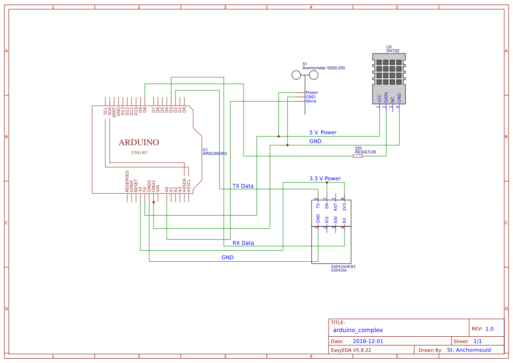
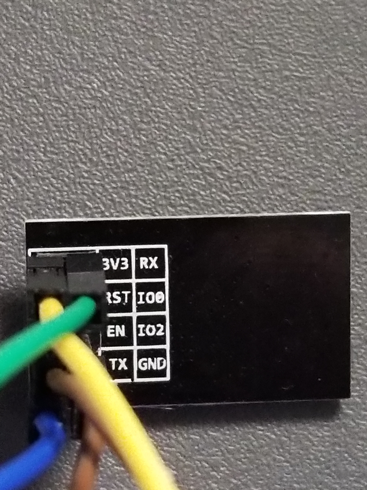

# Lesson 6: Setting up the arduino for a complex weather station [~60 minutes]

In order to have the full weather station, we must first setup the arduino.

Let's get started!

### Step one: Wiring the circuit

To begin, wire the DHT22 sensor to the arduino using the same method in lesson 5. The schematic is included below:



 That is, connect the power pin to the `+` on the breadboard and the data pin (middle pin) to pin 7 on the arduino. There is one difference with this. Have `GND` go to the `-` on the breadboard. Then connect one of the `GND` pins on the arduino to the `-` column on the breadboard.

 > NOTE: The `+` column needs to have 5 volts of power for the temperature sensor. We will have the other `+` column have 3.3 volts. Be very careful about what you plug into the 5 volt `+` column as plugging the wifi module into it will destroy it!!

 Now that the DHT22 sensor is wired up, we must wire up the wind sensor. The wind sensor has a plug with three cables in it. One is brown, one is black, and the one in between the brown and black is blue. Plug the brown cable into the 5 volt column (the `+` column, but we will refer to it as `5 volt column` as there will be two `+` columns in this project) on the breadboard. Plug the black cable into the `-` column. Finally, plug the blue cable into pin `A0` on the arduino.

 The final thing we must wire is the wifi module. To begin, run a cable from the 3.3 volt pin on the arduino to the `+` column that is not being used.

 > NOTE: Do not plug the 3.3 volt pin into the 5 volt column on accident. If the board is turned on, bad things will happen. Make sure to separate the 5 volt and 3.3 volt into two separate `+` columns, and remember which is which.

 On the wifi module, there is a key with the name of each pin on it. For instance, `3V3` is shown in the top left of the module.  The `3V3` pin is, therefore, the top left pin.

 Plug the `3V3` and `EN` pins into the 3.3 volt `+` column on the breadboard.

 > CAUTION: THIS IS WHERE YOU MUST NOT PLUG THE CABLES INTO THE 5 VOLT COLUMN. THAT WOULD DESTROY THE MODULE!

 Plug the `GND` pin into the `-` rail on the breadboard. Finally, plug the `RX` pin into pin 0 and the `TX` pin into pin 1.

 Now that that is setup, it is time to start setting up the code.

 ### Step two: Setting up the code

 ##### ESP8266 Wifi module setup:

 To begin, there is one command that we must do before we can run the code. Open up the arduino IDE and open the serial monitor. Down at the bottom right, it will say `9600 baud`. Click on this and change the value to `115200`. Now that that is done, unplug the arduino and replug it in.

 Next, click on the button that says `Newline` and change it to `Both NL & CL`. Close the serial monitor and open it up again. Now we are ready to start. In the bar at the top, there is a button that says send on the right side with a text entry field to the left. Select this text field (this should be selected by default) and enter `AT`. If the serial says
```C++
AT


OK
```
everything is working. If it doesn't, unplug the pins connected to pins 0 and 1 on the arduino. Then, switch the position they were originally connected to. Try closing the serial monitor and opening it again. Type `AT` and wait for
```C++
AT


OK
```
If nothing happens, make sure the bottom right says `115200 baud` and `Both NL & CL`. Also, try switching pins 0 and 1 again.

If it is working, type in `AT+CIOBAUD=9600` and hit enter. After a couple of seconds, you are done!

At the bottom right, change `115200 baud` to `9600 baud` and restart both the serial monitor and the arduino IDE.

##### Arduino code setup:

First, we need to edit the pin placement of the wifi module. Disconnect pins 0 and 1. These should be connected to `TX` and `RX` on the wifi module. Connect the wire from `TX` to pin 2 on the arduino. Then, connect the wire from `RX` to pin 3 on the arduino. This is the final circuit we will use for the weather station!

Next, go to https://github.com/russelltg/weatherstation/blob/master/arduino/arduino_complex/arduino_complex.ino/ and copy the code. Paste it into the arduino software. Before uploading, we need to enter in the information about your wifi network.

Hit `ctrl + f` in the arduino menu. This is a search menu. It will find whatever you type into the seach menu in the code. Enter in `AT+CWJAP` in the search menu. This will take you to a line that looks like this:
```C++
ret = at_command("AT+CWJAP=\"MOORE FAMILY\",\"brightraccoon030\"", -1, &out);
```
Where the code says `MOORE FAMILY`, put the name of your wifi network. Where the code says `brightraccoon030`, put the password for your wifi network. Be sure not to remove the `""` or the `\` from the code. Save this file with the changes and upload to the board.

Open the serial monitor. Make sure that the bottom right says `9600 baud` and `Both NL & CL`. Then, take a look at what is popping up in the monitor. To make this easier, deselect autoscroll by clicking the button that says `Autoscroll` in the bottom right. Let the code run for a little while, then look for a line that says:

```
AT+CIFSR

+CIFSR:STAIP,"192.168.1.123"
+CIFSR:STAMAC,"ec:fa:bc:20:eb:24"
```

Write down the number in the spot that `192.168.1.123` is. This is the IP address for the weather station. This is required to connect the arduino to the raspberry pi in later lessons.

If you are not seeing the line that says `+CIFSR:STAIP,"192.168.1.123"`, something is wrong with the network name and password. Check both to make sure they are right.

If you have the IP address, congratulations! The arduino is fully set up.
