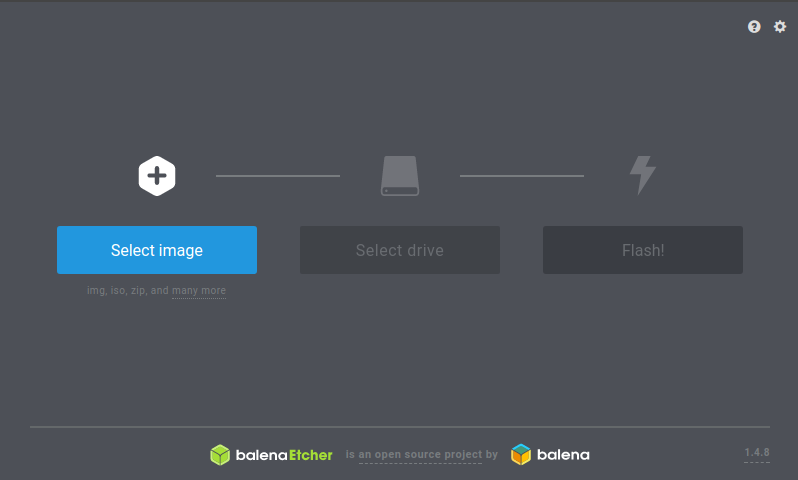
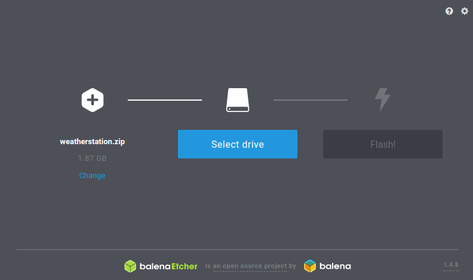
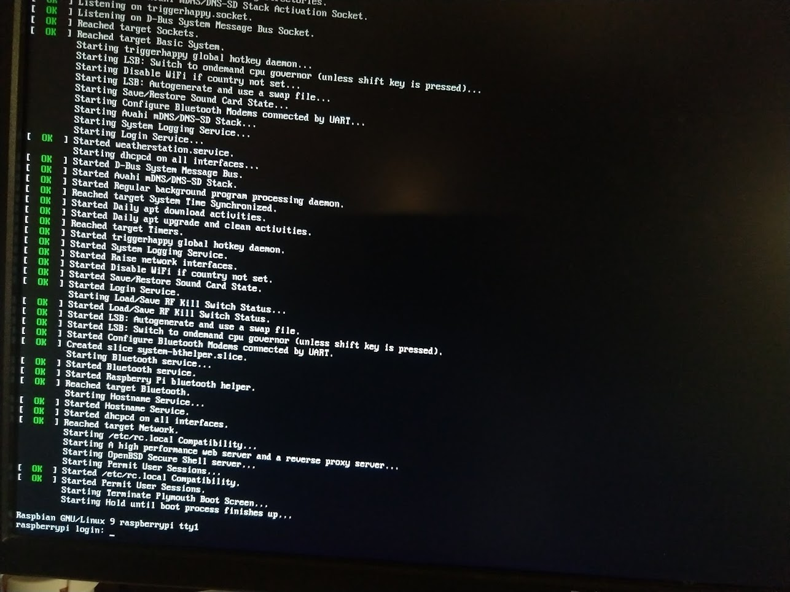
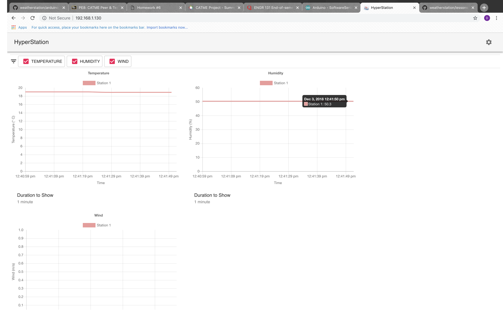

# Lesson 7: Setting up the raspberry pi server [~30 minutes]

In this lesson, you will learn how to setup a simple Raspberry Pi server.

Servers are quite complex in nature, so most of the heavy lifting has been done
for you, you will just need to set it up.

## Step 1: Flashing the ISO
The Raspberry Pi comes with a built-in micro SD slot, so we need to install the server on it.
A disk image file (.iso) has been prepared with all the required software to run the server,
all you have to do is install it.

Download the .zip file from [here](https://github.com/russelltg/weatherstation/releases/download/v0.2/weatherstation.zip),
and [install the etcher tool](https://www.balena.io/etcher/), which will be used to install the disk image onto the microSD card.

Insert the micro SD card into your computer (you will need some sort of micro sd card reader), and open etcher:



Click `Select image`, and select the `.zip` file you just downloaded:



Click `Select drive` and select the microsd card. Click the `Flash!` button and wait for the process to finish. Once this is complete, you will be ready to start with the raspberry pi.

Put the micro SD card into the raspberry pi to finish the ISO setup.

## Step 2: Configuring wireless

Plug the raspberry pi into a keyboard and
monitor via USB and HDMI respectively. Power it on by plugging in the mini-usb power cord.
When it boots, you should be prompted with:



You should be left at a prompt for a username and
password. The default is `pi` for username and
`raspberry` for password. Note when you are entering the
password, it will not show anything so that the password is not
displayed on the screen.

### Tour of Bash (the linux terminal)

The linux terminal (aka bash, which stands for bourne again shell), is a extremely powerful tool
that can be used to do almost anything, and is the
tool of choice for many programmers.

It works by taking in commands, which are in the format:

```
<COMMAND> <PARAMETERS...>
```

for example:

```bash
cd ..
```

The `cd` command, which stands for "change directory,"
allows you to enter a different directory, like you would in
a file explorer.

`..` means the parent directory, analogous to pressing the up button in
a file explorer.

### Basic bash commands

| Command | Example  | Description |
| ------- | -------- | ----------- |
| cd      | cd hello | Change directory, the example changes into the `hello` directory. `..` represents the parent directory. |
| ls      | ls       | List files in the current directory |
| pwd     | pwd      | Prints the path to the current directory |
| rm      | rm hello.txt | Deleted a file |
| cat     | cat hello.txt | Print the contents of a file |


With this in mind, move into the directory `/etc/wpa_supplicant` with the `cd` command.

In this directory, there are files for configuring wifi connections.

In the command prompt, type:

```bash
sudo nano wpa_supplicant.conf
```

Which should open a text editor, were you can use the arrow keys on the keyboard to move around.

There should be a section that looks like:

```conf
network={
    SSID="<INSERT SSID HERE>"
    psk="<INSERT PASSPHRASE HERE>"
}
```

Inside those quotes, insert the SSID (wifi name) of the network the arduino is connected to and the passphrase for that wireless network. For example, the file we used for our wifi network named `MOORE FAMILY` with a passphrase of `password1234` looks like this:

```conf
network={
    SSID="MOORE FAMILY"
    psk="password1234"
}
```

> CAUTION: MAKE SURE THE WIFI NAME AND PASSPHRASE YOU ENTER IS THE SAME AS THE WIFI NETWORK THE ARDUINO IS CONNECTED TO OR THE TWO WILL NOT BE ABLE TO WORK TOGETHER!

 When you are done editing the wifi name and passphrase, hit `CONTROL + O` (***Make sure this command is CTRL + 'OH', not CTRL + 'ZERO'***), then `ENTER`, then `CONTROL + X` to save. Then reboot the pi using the following command:

```bash
sudo reboot
```

The raspberry pi should be on the network now. To check that, run the following command:

```bash
iwgetid
```

if everything is configured properly, it should print the SDID (wifi name) for your network.

### Step 3: Get the IP

In the command prompt, type

```bash
ip addr
```

Which should have an output like this:

```
1: lo: <LOOPBACK,UP,LOWER_UP> mtu 65536 qdisc noqueue state UNKNOWN group default qlen 1000
    link/loopback 00:00:00:00:00:00 brd 00:00:00:00:00:00
    inet 127.0.0.1/8 scope host lo
       valid_lft forever preferred_lft forever
    inet6 ::1/128 scope host
       valid_lft forever preferred_lft forever
2: eth0: <BROADCAST,MULTICAST,UP,LOWER_UP> mtu 1500 qdisc pfifo_fast state UP group default qlen 1000
    link/ether b8:27:eb:b2:96:ab brd ff:ff:ff:ff:ff:ff
3: wlan0: <NO-CARRIER,BROADCAST,MULTICAST,UP> mtu 1500 qdisc pfifo_fast state DOWN group default qlen 1000
    link/ether b8:27:eb:e7:c3:fe brd ff:ff:ff:ff:ff:ff
    inet 192.168.1.127/24 brd 192.168.1.255 scope global eth0 <-- this is what you want
       valid_lft forever preferred_lft forever
    inet6 fe80::99ac:80cd:225c:f16/64 scope link
       valid_lft forever preferred_lft forever

```

Under `wlan0`, which is the name of the wireless chip on the raspberry pi, look for a line starting with `inet`. The numbers, up to the slash, is the
IP address of the raspberry PI. In the example output above, the ip is `192.168.1.127`. An IP address is like a regular address but for computers--it allows computers to send messages to each other remotely.

> Make sure you write this IP address down. You will need it to connect to the weather station.

On another computer connected to the same network, open a web browser and go to `http://<IP ADDRESS>`, replacing `<IP ADDRESS>` with your actual IP address. You should be able to see the web server.

For instance, the picture below is connected to a raspberry pi with an IP address of 192.168.1.130.



If all steps were successfully completed, you should see a page very similar to the image above, but the graphs showing data will, more than likely, not exist. This is because the arduino and the raspberry pi have not been linked together yet. In [lesson 8](lesson8.md), we will link the two, finishing the setup.
