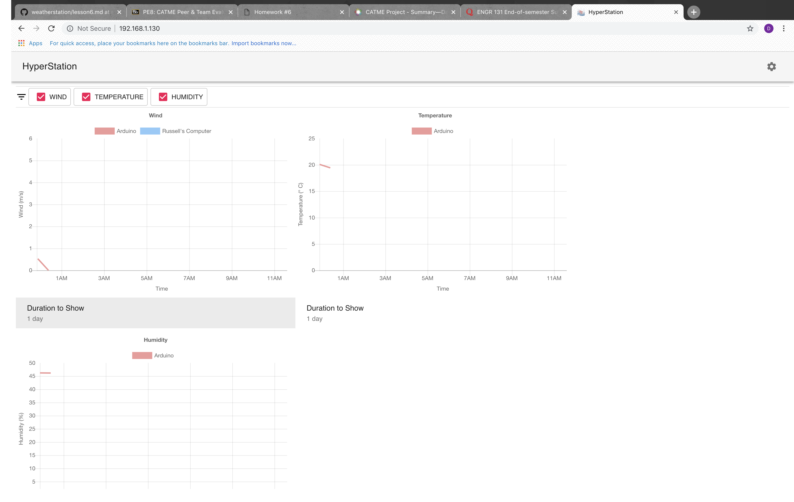
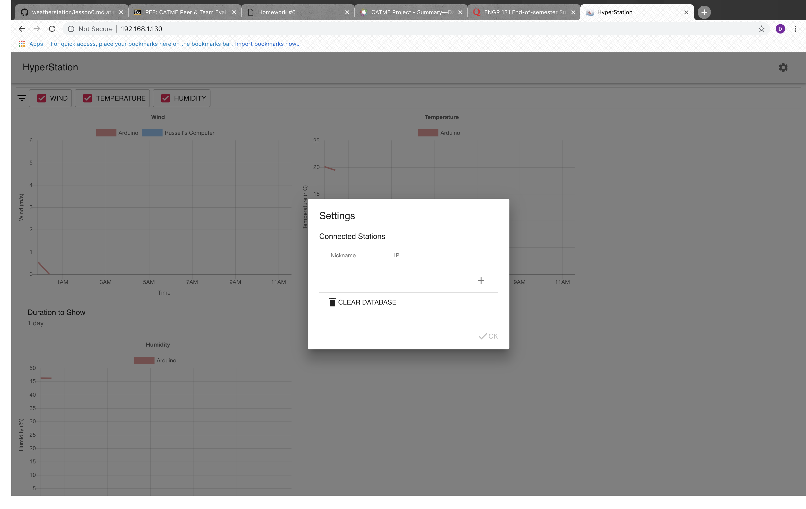
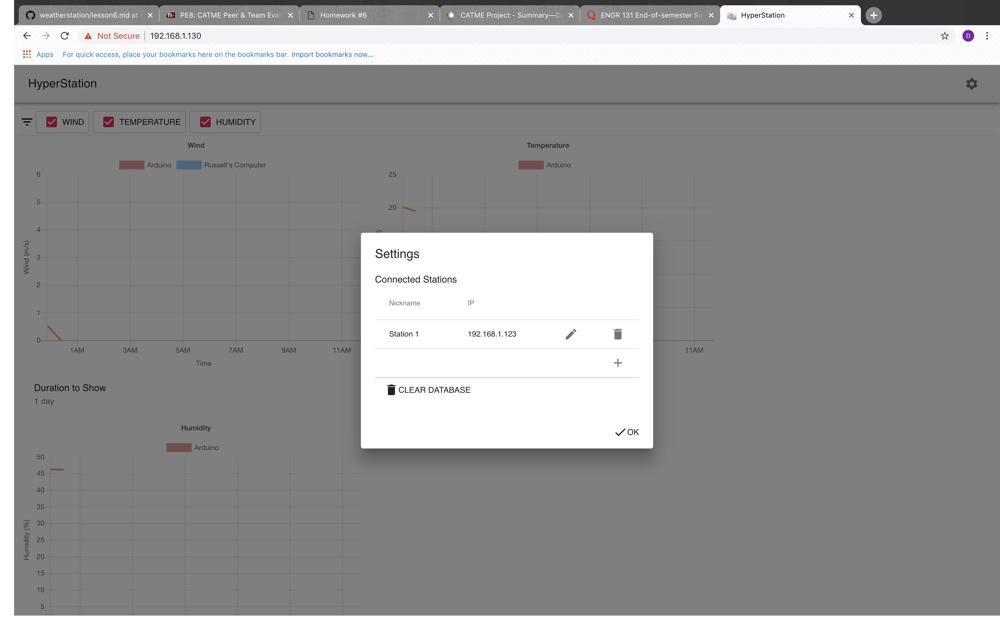

# Lesson 8: How to connect to a weather Station

If you already have the raspberry pi setup and the weather station running from lessons 6 and 7, you are all ready to connect to the station.

First, there are a few things to know:

* You must be on the same wifi network used in lesson 7 to setup the raspberry pi. If you aren't this will not work!

* You must have the IP address written down somewhere for easy access. If you can't remember the IP address, you will have to redo step 3 in lesson 6.

Let's get started!

### Step one: Connecting to the raspberry pi

On a device connected to the same wifi network as the raspberry pi, open up a web browser. Head to the top where you would enter in a website, and enter the IP address of the raspberry pi followed by `:8080`.

> Example
```
192.168.1.130:8080
```
This will connect to a raspberry pi with an IP address of `192.168.1.130`.

Now, you should see something that looks like this:



Yours will probably not have any charts showing or any data, but you should see `HyperStation` at the top left with a gear icon in the top right.

We are successfully connected to the raspberry pi, but we aren't connected to the arduino weather station yet.

### Step two: Connecting to the arduino weather Station

In lesson 6, we uploaded the code to the arduino and wrote down its IP address. We need to use that IP address now to connect to it. Hit the gear icon at the top right of the `HyperStation` screen. It will look like this:



Click the `+` button. This will generate a station named `StationName` with an IP of `0.0.0.0`. This is where we will put in the arduino station. Click the pencil icon to edit the values. Select the name `StationName`. Type in `Station 1`. Then, select the `0.0.0.0`. Here, enter in the IP address of the arduino we found in lesson 6. Now press the checkmark button to the right of the IP address. Finally, refresh the page.

If all goes well, this is what you should have seen before refreshing:



At this point, everything is set up. If no data starts coming in, unplug the raspberry pi and plug it back in. Then refresh the webpage. You should see realtime data flowing in.

To ensure the arduino is sending data, you can plug it into the computer and open the serial monitor. It should *NOT* say `Failed to send data to pi`. If this is the case, restart the arduino. Check the wifi name and password are correct and that the wifi network is the same as the one the raspberry pi is on. Also, check to see that the pi is working properly and is connected to the network.

> NOTE: Right after the system is setup, there will not be enough data to display charts that are set to 1 day. Therefore, you must select 1 minute to see the live data. After the station has been running for quite some time, you can use the 1 day feature to see the data over a large period of time!

> ALSO NOTE: IF SOMETHING ISN'T WORKING RIGHT WITH THE GRAPHS DISPLAYING, SIMPLY REFRESH THE PAGE. THIS WILL FIX ERRORS IN DISPLAYING!

At this point, you should be good to go. Anyone connected to the network can now enter the IP address followed by `:8080` and connect to the sensors!
